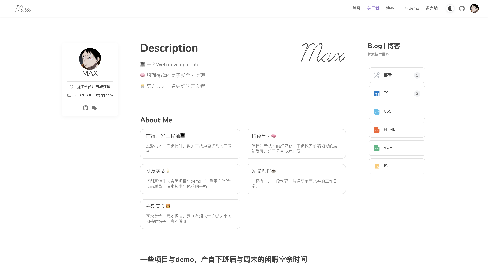
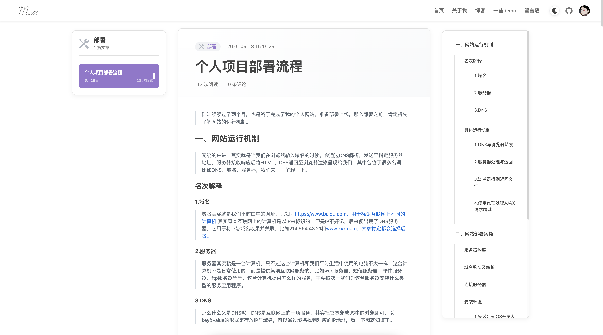
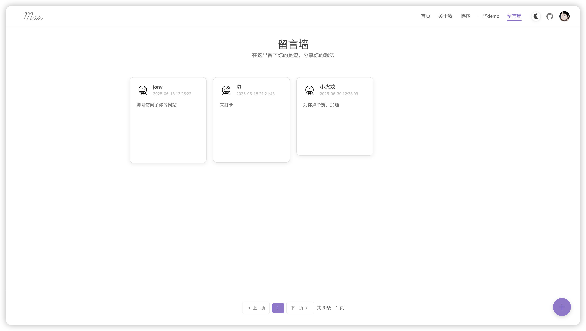

# 个人博客网站

一个基于 Vue 3 开发的现代化个人网站/博客系统，具有美观的 UI、流畅的动画效果和完善的功能。支持博客发布、展示、分类，以及项目展示、留言互动等功能，同时开发了一些小游戏。

## 技术栈

-   **前端框架**：Vue 3 + Composition API
-   **构建工具**：Vite
-   **路由管理**：Vue Router
-   **样式处理**：SCSS (含主题切换、媒体查询等)
-   **UI 组件**：自定义组件
-   **HTTP 请求**：Axios

## 功能特点

-   🌙 **深色/浅色主题切换** - 支持多主题模式切换
-   📱 **响应式设计** - 完美适配桌面和移动设备
-   🖼️ **图片预览** - 支持全屏查看，保持原始比例
-   📝 **博客系统** - 支持详情浏览和列表展示
-   🏠 **首页轮播** - 动态展示重要内容
-   💬 **留言系统** - 支持用户交流
-   👤 **关于我** - 个人简介展示
-   🛠️ **Demo 项目** - 展示个人作品集
-   📝 **文章预览** - 博客预览、目录导航
-   🎮 **小游戏** - 包含一些自主开发的趣味小游戏，持续开发中

## 目录结构

```
src/
│
├── assets/           # 静态资源文件
├── components/       # 通用组件
│   ├── avatar/       # 头像组件
│   ├── empty/        # 空状态组件
│   ├── header/       # 页头组件
│   ├── icon/         # 图标组件
│   ├── imgLoader/    # 图片加载组件
│   ├── loading/      # 加载状态组件
│   ├── message/      # 消息提示组件
│   └── ...
│
├── css/              # 全局样式
│   ├── base.scss     # 基础样式
│   ├── media.scss    # 媒体查询
│   ├── mixin.scss    # 混入样式
│   ├── theme.scss    # 主题配置
│   └── ...
│
├── views/            # 页面视图
│   ├── about/        # 关于页面
│   ├── blogDetail/   # 博客详情页
│   ├── blogList/     # 博客列表页
│   ├── demo/         # 项目展示页
│   ├── home/         # 首页
│   ├── layout/       # 布局组件
│   ├── message/      # 留言页面
│   └── resource/     # 资源页面
│   ├── games/        # 游戏列表页面
│   ├── ...
│
├── router/           # 路由配置
├── stores/           # 状态管理
├── http/             # HTTP请求封装
├── utils/            # 工具函数
├── hooks/            # 自定义Hook
├── directive/        # 自定义指令
│
├── App.vue           # 根组件
└── main.js           # 入口文件
```

### 一些截图预览







